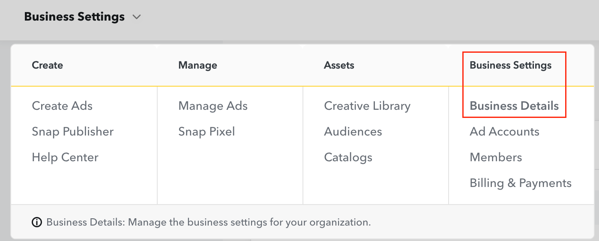
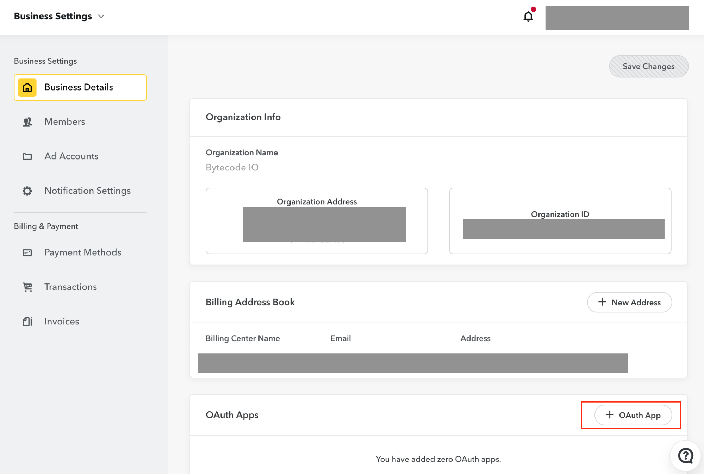
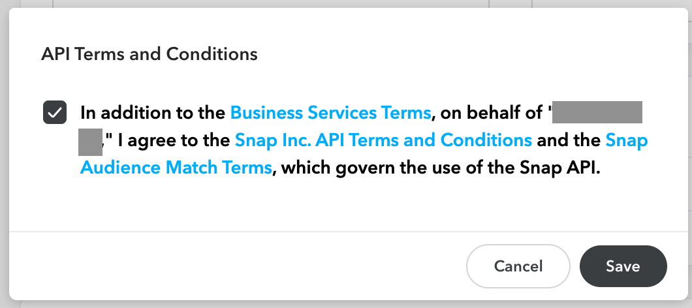
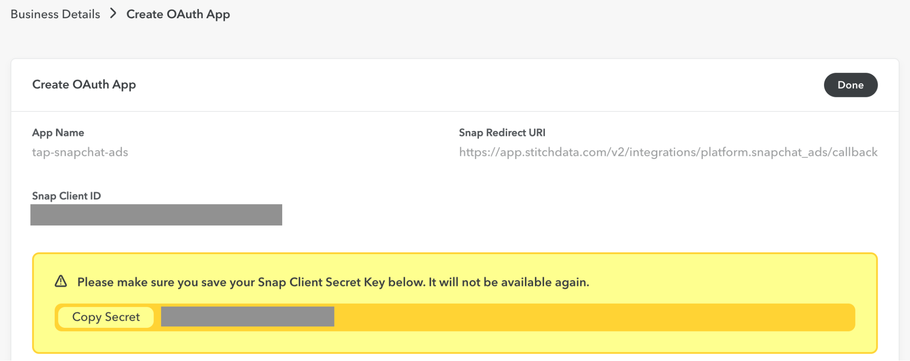

# tap-snapchat-ads

This is a [Singer](https://singer.io) tap that produces JSON-formatted data
following the [Singer
spec](https://github.com/singer-io/getting-started/blob/master/SPEC.md).

This tap:

- Pulls raw data from the [Snapchat Ads Marketing API](https://developers.snapchat.com/api/docs/#introduction)
- Extracts the following resources:
  - [organizations](https://developers.snapchat.com/api/docs/#get-all-organizations)
    - [funding_sources](https://developers.snapchat.com/api/docs/?python#funding-sources)
    - [billing_centers](https://developers.snapchat.com/api/docs/?python#get-all-billing-centers)
    - [members](https://developers.snapchat.com/api/docs/?python#get-all-members-of-an-organization)
    - [roles](https://developers.snapchat.com/api/docs/?python#get-all-roles-in-organization)
    - [ad_accounts](https://developers.snapchat.com/api/docs/#get-all-ad-accounts)
      - [ad_account_stats_daily](https://developers.snapchat.com/api/docs/#get-ad-account-stats)
      - [ad_account_stats_hourly](https://developers.snapchat.com/api/docs/#get-ad-account-stats)
      - [audience_segments](https://developers.snapchat.com/api/docs/#get-all-audience-segments)
      - [pixels](https://developers.snapchat.com/api/docs/#get-the-pixel-associated-with-an-ad-account)
        - [pixel_domain_stats](https://developers.snapchat.com/api/docs/#get-pixel-domains)
      - [media](https://developers.snapchat.com/api/docs/#get-all-media)
      - [creatives](https://developers.snapchat.com/api/docs/#get-all-creatives)
      - [phone_numbers](https://developers.snapchat.com/api/docs/#swipe-to-call-text-phone-number-verification)
      - [campaigns](https://developers.snapchat.com/api/docs/#get-all-campaigns)
        - [campaign_stats_daily](https://developers.snapchat.com/api/docs/#get-campaign-stats)
        - [campaign_stats_hourly](https://developers.snapchat.com/api/docs/#get-campaign-stats)
      - [ad_squads](https://developers.snapchat.com/api/docs/#get-all-ad-squads-under-an-ad-account)
        - [ad_squad_stats_daily](https://developers.snapchat.com/api/docs/#get-ad-squad-stats)
        - [ad_squad_stats_hourly](https://developers.snapchat.com/api/docs/#get-ad-squad-stats)
      - [ads](https://developers.snapchat.com/api/docs/#get-all-ads-under-an-ad-account)
        - [ad_stats_daily](https://developers.snapchat.com/api/docs/#get-ad-stats)
        - [ad_stats_hourly](https://developers.snapchat.com/api/docs/#get-ad-stats)
      - [product_catalogs](https://developers.snapchat.com/api/docs/#get-all-catalogs)
        - [product_sets](https://developers.snapchat.com/api/docs/#get-all-product-sets)
  - **Targeting**:
    - **Demographics**
      - [targeting_age_groups](https://developers.snapchat.com/api/docs/#demographics-age-groups)
      - [targeting_genders](https://developers.snapchat.com/api/docs/#demographics-gender)
      - [targeting_languages](https://developers.snapchat.com/api/docs/#demographics-language)
      - [targeting_advanced_demographics](https://developers.snapchat.com/api/docs/#demographics-advanced-demographics)
    - **Devices**
      - [targeting_connection_types](https://developers.snapchat.com/api/docs/#device-connection-type)
      - [targeting_os_types](https://developers.snapchat.com/api/docs/#device-os-type)
      - [targeting_ios_versions](https://developers.snapchat.com/api/docs/#device-os-version)
      - [targeting_android_versions](https://developers.snapchat.com/api/docs/#device-os-version)
      - [targeting_carriers](https://developers.snapchat.com/api/docs/#device-carrier)
      - [targeting_device_makes](https://developers.snapchat.com/api/docs/#device-make)
    - **Geography**
      - [targeting_countries](https://developers.snapchat.com/api/docs/#geolocation-country)
      - [targeting_regions](https://developers.snapchat.com/api/docs/#geolocation-region-state)
      - [targeting_metros](https://developers.snapchat.com/api/docs/#geolocation-metro-dma)
      - [targeting_postal_codes](https://developers.snapchat.com/api/docs/#zipcode)
    - **Interests**
      - [targeting_interests_scls](https://developers.snapchat.com/api/docs/#interests-snap-lifestyle-categories): Snap Lifestyle Categories
      - [targeting_interests_dlxs](https://developers.snapchat.com/api/docs/#get-oracle-datalogix-dlxs-interest-targeting-options): Oracle Datalogix DLXS
      - [targeting_interests_dlxc](https://developers.snapchat.com/api/docs/#get-oracle-datalogix-dlxc-interest-targeting-options): Oracle Datalogix DLXC
      - [targeting_interests_dlxp](https://developers.snapchat.com/api/docs/#get-oracle-datalogix-dlxp-interest-targeting-options): Oracle Datalogix DLXP
      - [targeting_interests_nln](https://developers.snapchat.com/api/docs/#get-nielsen-interest-targeting-options): Nielsen
      - [targeting_interests_plc](https://developers.snapchat.com/api/docs/#interests-placed-visitation-segments): Placed Visitation Segments
    - **Locations**
      - [targeting_location_categories](https://developers.snapchat.com/api/docs/#location)

- Outputs the schema for each resource
- Incrementally pulls data based on the input state
- Results are **NOT** sorted.

- Most Endpoints (except `_stats_` reports and `targeting` endpoints)
  - Replication Strategy: INCREMENTAL, query all, filter results
  - Bookmark: `updated_at`
  - Primary Key: `id`

- `_stats_` reports:
  - Replication Strategy: INCREMENTAL, query
  - Date Windows: Reports use from/to date windowing and incorporate swipe/view attribution (lookback) windows.
  - Bookmarks: `end_time`
  - Primary Keys: `id`, `start_time`

- `targeting` endpoints:
  - Replication Strategy: FULL_TABLE
  - Primary Key: `id`

## Authentication
The Snapchat Ads Marketing API uses OAuth for API Authentication. Follow these instructions to: [Obtain App Credentials](https://developers.snapchat.com/api/docs/#obtain-app-credentials).

1. Login to [Snapchat Business Manager](https://business.snapchat.com/).
2. Select **Business Settings > Business Details**

  

3. Click **+ OAuth App**

  

4. Accept / Save API Terms and Conditions
  
  

5. Enter **App Name: **tap-snapchat-ads, **Snap Redirect URI:** **YOUR_REDIRECT_URI**, example: https://app.stitchdata.com/v2/integrations/platform.snapchat_ads/callback

  

6. Copy your credentials, `client_id` and `client_secret`.

  

7. Enter the following (adjusted) URL into your browser:
    1. URL: https://accounts.snapchat.com/login/oauth2/authorize?client_id=`YOUR_CLIENT_ID`&redirect_uri=`YOUR_REDIRECT_URI`
    2. Authenticate the API App with username, password, and connection approval (Continue, Continue).
    3. Code: Capture the ...&`code=xxxxxx…` in the redirect URL. This `code` is used in the next step to generate the `refresh_token`.

  

  

8. Run the following curl command with the parameters replaced to return your `refresh_token`. The `refresh_token` persists indefinitely and is used to generate an `access_token` (short-lived) for authenticating each API Call.
    ```
    curl -0 -v -X POST https://accounts.snapchat.com/login/oauth2/access_token\
        -H "Accept: application/json"\
        -H "Content-Type: application/x-www-form-urlencoded"\
        -d "client_id=YOUR_CLIENT_ID"\
        -d "client_secret=YOUR_CLIENT_SECRET"\
        -d "code=YOUR_CODE"\
        -d "grant_type=authorization_code"\
        -d "redirect_uri=YOUR_REDIRECT_URI"
    ```

From the response (JSON), record the `refresh_token`.

9. Run the following curl command with the parameters replaced to return your **access_token** for authenticating each API Call.

    ```
    curl -0 -v -X POST https://accounts.snapchat.com/login/oauth2/access_token\
        -H "Accept: application/json"\
        -H "Content-Type: application/x-www-form-urlencoded"\
        -d "client_id=YOUR_CLIENT_ID"\
        -d "client_secret=YOUR_CLIENT_SECRET"\
        -d "grant_type=refresh_token"\
        -d "refresh_token=YOUR_REFRESH_TOKEN"

From the response (JSON), record the `access_token`.

10. Create config.json and include the `client_id`, `client_secret`, and `refresh_token`.
    ```json
    {
      "client_id": "YOUR_CLIENT_ID",
      "client_secret": "YOUR_CLIENT_SECRET",
      "refresh_token": "YOUR_REFRESH_TOKEN",
      "swipe_up_attribution_window": "28_DAY",
      "view_attribution_window": "7_DAY",
      "omit_empty": "true",
      "targeting_country_codes": "us, ca, mx",
      "start_date": "2020-01-01T00:00:00Z",
      "user_agent": "tap-snapchat-ads <api_user_email@example.com>",
      "request_timeout": 100
    }
    ```
Additional config parameters
- `swipe_up_attribution_window`: Attribution window for swipe ups. 1_DAY, 7_DAY, 28_DAY (default).
- `view_attribution_window`: Attribution window for views. 1_HOUR, 3_HOUR, 6_HOUR, 1_DAY (default), 7_DAY, 28_DAY.
- `omit_empty` (true, false): Omits records with zero data for all metrics for a given date/entity. If there is data for any metric for a given date/entity, all metrics for that date/entity are returned. 
- `targeting_country_codes`: Comma-delimeted lists of lower-case 2-letter ISO Country Codes for Ads Targeting.
- `request_timeout`: The time for which request should wait to get a response and the default request_timeout is 300 seconds.

## Quick Start

1. Install

    Clone this repository, and then install using setup.py. We recommend using a virtualenv:

    ```bash
    > virtualenv -p python3 venv
    > source venv/bin/activate
    > python setup.py install
    OR
    > cd .../tap-snapchat-ads
    > pip install .
    ```
2. Dependent libraries
    The following dependent libraries were installed.
    ```bash
    > pip install target-json
    > pip install target-stitch
    > pip install singer-tools
    > pip install singer-python
    ```
    - [singer-tools](https://github.com/singer-io/singer-tools)
    - [target-stitch](https://github.com/singer-io/target-stitch)


3. Optionally, also create a `state.json` file. `currently_syncing` is an optional attribute used for identifying the last object to be synced in case the job is interrupted mid-stream. The next run would begin where the last job left off.

    ```json
    {
      "currently_syncing": "sitemaps",
      "bookmarks": {
        "ad_squad_stats_daily": {
          "end_time(parent_ad_squad_id:537a0933-87fb-4450-8f0c-9c890b451971)": "2020-06-24T07:00:00.000000Z",
          "end_time(parent_ad_squad_id:4a0ba80d-8c12-4467-9c91-d9888a28d65c)": "2020-06-24T07:00:00.000000Z",
          "..."
        },
        "campaign_stats_hourly": {
          "end_time(parent_campaign_id:e76d71d4-1bb0-49d8-bf52-9c22fb35d24a)": "2020-06-24T15:00:00.000000Z",
          "end_time(parent_campaign_id:b4c59d32-06d3-40d9-b896-e1b6191d88a5)": "2020-06-24T15:00:00.000000Z",
          "..."
        },
        "billing_centers": {
          "updated_at(parent_organization_id:d373b68c-a28e-4fbe-8ba2-38a85925d7be)": "2020-05-13T16:43:10.841000Z"
        },
        "ad_squad_stats_hourly": {
          "end_time(parent_ad_squad_id:537a0933-87fb-4450-8f0c-9c890b451971)": "2020-06-24T15:00:00.000000Z",
          "end_time(parent_ad_squad_id:4a0ba80d-8c12-4467-9c91-d9888a28d65c)": "2020-06-24T15:00:00.000000Z",
          "..."
        },
        "audience_segments": {
          "updated_at(parent_ad_account_id:a792a56f-66f0-407e-82ca-ccb30ced0ba7)": "2020-06-09T14:21:28.793000Z"
        },
        "creatives": {
          "updated_at(parent_ad_account_id:a792a56f-66f0-407e-82ca-ccb30ced0ba7)": "2020-05-13T22:45:10.211000Z"
        },
        "campaigns": {
          "updated_at(parent_ad_account_id:ef0ae960-145f-4b2f-a574-91ffc73f5bfe)": "2020-05-13T20:49:08.794000Z"
        },
        "pixels": {
          "updated_at(parent_ad_account_id:353223b7-6d20-4686-899b-29176f7c439c)": "2020-05-14T02:18:37.604000Z"
        },
        "ad_account_stats_hourly": {
          "end_time(parent_ad_account_id:a792a56f-66f0-407e-82ca-ccb30ced0ba7)": "2020-06-24T15:00:00.000000Z",
          "..."
        },
        "ad_squads": {
          "updated_at(parent_ad_account_id:ff7ed2f7-5ca4-4a8b-9848-d09024e06b66)": "2020-05-14T00:04:37.878000Z"
        },
        "ad_stats_hourly": {
          "end_time(parent_ad_id:1876617a-7f3a-4743-932a-f37e94481b52)": "2020-06-24T15:00:00.000000Z",
          "end_time(parent_ad_id:4ea60ebe-2224-45a2-8df7-96f82d392824)": "2020-06-24T15:00:00.000000Z",
          "..."
        },
        "phone_numbers": {
          "updated_at(parent_ad_account_id:a792a56f-66f0-407e-82ca-ccb30ced0ba7)": "2020-04-01T00:00:00Z"
        },
        "campaign_stats_daily": {
          "end_time(parent_campaign_id:e76d71d4-1bb0-49d8-bf52-9c22fb35d24a)": "2020-06-24T07:00:00.000000Z",
          "end_time(parent_campaign_id:b4c59d32-06d3-40d9-b896-e1b6191d88a5)": "2020-06-24T07:00:00.000000Z",
          "..."
        },
        "ad_account_stats_daily": {
          "end_time(parent_ad_account_id:a792a56f-66f0-407e-82ca-ccb30ced0ba7)": "2020-06-24T07:00:00.000000Z",
          "..."
        }
      }
    }
    ```

4. Run the Tap in Discovery Mode
    This creates a catalog.json for selecting objects/fields to integrate:
    ```bash
    tap-snapchat-ads --config config.json --discover > catalog.json
    ```
   See the Singer docs on discovery mode
   [here](https://github.com/singer-io/getting-started/blob/master/docs/DISCOVERY_MODE.md#discovery-mode).

5. Run the Tap in Sync Mode (with catalog) and [write out to state file](https://github.com/singer-io/getting-started/blob/master/docs/RUNNING_AND_DEVELOPING.md#running-a-singer-tap-with-a-singer-target)

    For Sync mode:
    ```bash
    > tap-snapchat-ads --config tap_config.json --catalog catalog.json > state.json
    > tail -1 state.json > state.json.tmp && mv state.json.tmp state.json
    ```
    To load to json files to verify outputs:
    ```bash
    > tap-snapchat-ads --config tap_config.json --catalog catalog.json | target-json > state.json
    > tail -1 state.json > state.json.tmp && mv state.json.tmp state.json
    ```
    To pseudo-load to [Stitch Import API](https://github.com/singer-io/target-stitch) with dry run:
    ```bash
    > tap-snapchat-ads --config tap_config.json --catalog catalog.json | target-stitch --config target_config.json --dry-run > state.json
    > tail -1 state.json > state.json.tmp && mv state.json.tmp state.json
    ```

6. Test the Tap
    
    While developing the Snapchat Ads Marketing tap, the following utilities were run in accordance with Singer.io best practices:
    Pylint to improve [code quality](https://github.com/singer-io/getting-started/blob/master/docs/BEST_PRACTICES.md#code-quality):
    ```bash
    > pylint tap_snapchat_ads -d missing-docstring -d logging-format-interpolation -d too-many-locals -d too-many-arguments
    ```
    Pylint test resulted in the following score:
    ```bash
    Your code has been rated at 9.61/10.
    ```

    To [check the tap](https://github.com/singer-io/singer-tools#singer-check-tap) and verify working:
    ```bash
    > tap-snapchat-ads --config tap_config.json --catalog catalog.json | singer-check-tap > state.json
    > tail -1 state.json > state.json.tmp && mv state.json.tmp state.json
    ```
    Check tap resulted in the following:
    ```bash
      Checking stdin for valid Singer-formatted data
      The output is valid.
      It contained 68128 messages for 46 streams.

          46 schema messages
        68128 record messages
          653 state messages

      Details by stream:
      +---------------------------------+---------+---------+
      | stream                          | records | schemas |
      +---------------------------------+---------+---------+
      | ad_squads                       | 8       | 1       |
      | pixels                          | 1       | 1       |
      | funding_sources                 | 0       | 1       |
      | ads                             | 80      | 1       |
      | roles                           | 4       | 1       |
      | organizations                   | 1       | 1       |
      | billing_centers                 | 1       | 1       |
      | campaign_stats_hourly           | 3754    | 1       |
      | ad_account_stats_daily          | 156     | 1       |
      | ad_account_stats_hourly         | 3743    | 1       |
      | ad_stats_daily                  | 237     | 1       |
      | phone_numbers                   | 0       | 1       |
      | product_sets                    | 2       | 1       |
      | ad_stats_hourly                 | 3822    | 1       |
      | audience_segments               | 14      | 1       |
      | ad_squad_stats_hourly           | 3750    | 1       |
      | campaigns                       | 12      | 1       |
      | product_catalogs                | 2       | 1       |
      | ad_accounts                     | 1       | 1       |
      | ad_squad_stats_daily            | 165     | 1       |
      | campaign_stats_daily            | 169     | 1       |
      | media                           | 31      | 1       |
      | pixel_domain_stats              | 1       | 1       |
      | members                         | 4       | 1       |
      | creatives                       | 11      | 1       |
      | targeting_interests_nln         | 1343    | 1       |
      | targeting_postal_codes          | 48335   | 1       |
      | targeting_genders               | 3       | 1       |
      | targeting_interests_scls        | 163     | 1       |
      | targeting_connection_types      | 2       | 1       |
      | targeting_advanced_demographics | 76      | 1       |
      | targeting_interests_plc         | 158     | 1       |
      | targeting_carriers              | 495     | 1       |
      | targeting_location_categories   | 159     | 1       |
      | targeting_device_makes          | 843     | 1       |
      | targeting_languages             | 21      | 1       |
      | targeting_interests_dlxp        | 163     | 1       |
      | targeting_countries             | 73      | 1       |
      | targeting_interests_dlxs        | 187     | 1       |
      | targeting_metros                | 357     | 1       |
      | targeting_ios_versions          | 91      | 1       |
      | targeting_age_groups            | 5       | 1       |
      | targeting_android_versions      | 35      | 1       |
      | targeting_os_types              | 2       | 1       |
      | targeting_regions               | 97      | 1       |
      | targeting_interests_dlxc        | 77      | 1       |
      +---------------------------------+---------+---------+

    ```
---

Copyright &copy; 2020 Stitch
